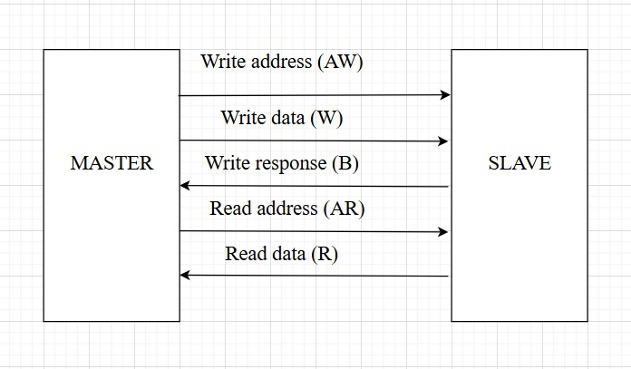
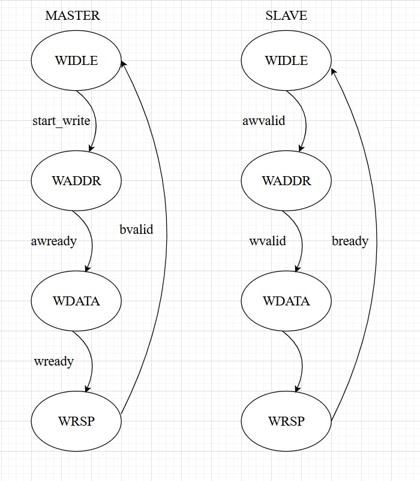
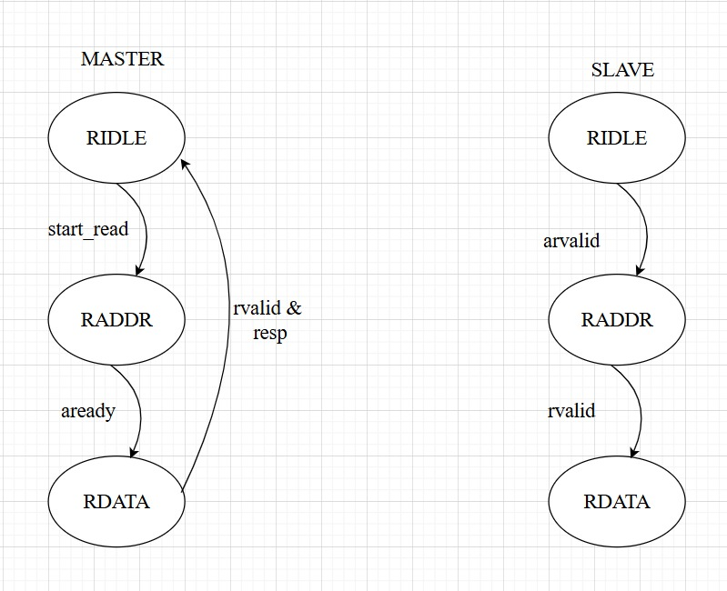
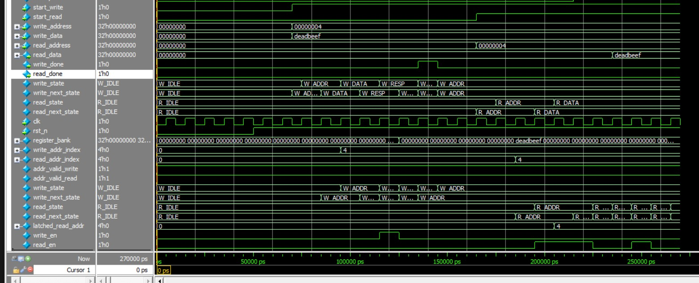
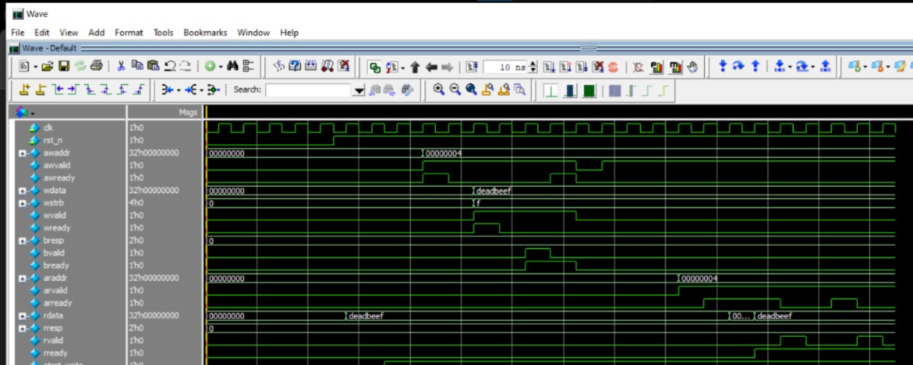
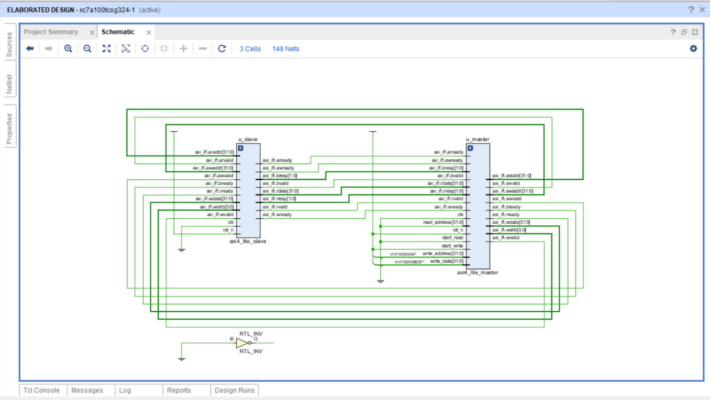

# AXI4-Lite Master/Slave Design

##  Overview

This project implements a **basic AXI4-Lite master and slave system** in SystemVerilog.
It contains three components:

1. **`axi4_lite_if`** → Interface definition with modports (master & slave).
2. **`axi4_lite_master`** → Simple master FSM that can issue read/write transactions.
3. **`axi4_lite_slave`** → Register-mapped slave with a 16 × 32-bit register bank.

The design demonstrates **AXI4-Lite protocol basics** (single transactions, no bursts) and is suitable for **verification testbenches** or **small SoC integrations**.

---
##  Files

* `axi4_lite_if.sv` → Defines the AXI4-Lite interface and modports.
* `axi4_lite_master.sv` → Implements the master FSM for read/write.
* `axi4_lite_slave.sv` → Implements the slave with register bank.

---
##  Axi4-lite top module

---

##  Parameters

### Slave Register Bank

* **16 registers (32-bit each)**
* Address map:

  * `0x00` → Register 0
  * `0x04` → Register 1
  * …
  * `0x3C` → Register 15

Invalid addresses return **`32'hDEAD_BEEF`**.

---

##  AXI4-Lite Channels Implemented

### Write Channel

* **Master:**

  * Sends `awaddr`, `awvalid`, `wdata`, `wvalid`, `wstrb`.
  * Waits for `awready`, `wready`, and `bvalid`.

* **Slave:**

  * Accepts address/data, writes into register bank.
  * Returns `bresp = OKAY (2'b00)` or `SLVERR (2'b10)` if address invalid.

### Read Channel

* **Master:**

  * Sends `araddr`, `arvalid`.
  * Waits for `arready` and `rvalid`.
  * Captures `rdata` + `rresp`.

* **Slave:**

  * Accepts read address, returns register content.
  * Responds with `rresp = OKAY (2'b00)` or error if invalid address.

---

##  Master Slave State Machines

### Write FSM

### Read FSM

 Handshake signals (`write_done`, `read_done`) assert for **1 cycle** when transactions complete.

---

##  Example Transaction

* **Write:**
  `write_address = 32'h04; write_data = 32'hDEADBEEFS; start_write = 1;`
  → Master writes to **Register 2**.

* **Read:**
  `read_address = 32'h04; start_read = 1;`
  → Master reads back from **Register 2**.

---
## Testbench verification module

---

## Vivado simulation 

