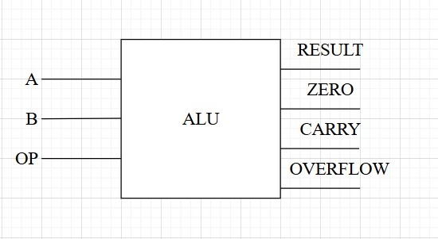
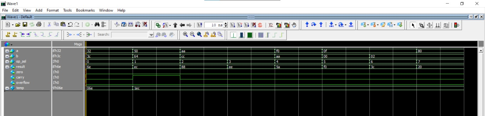
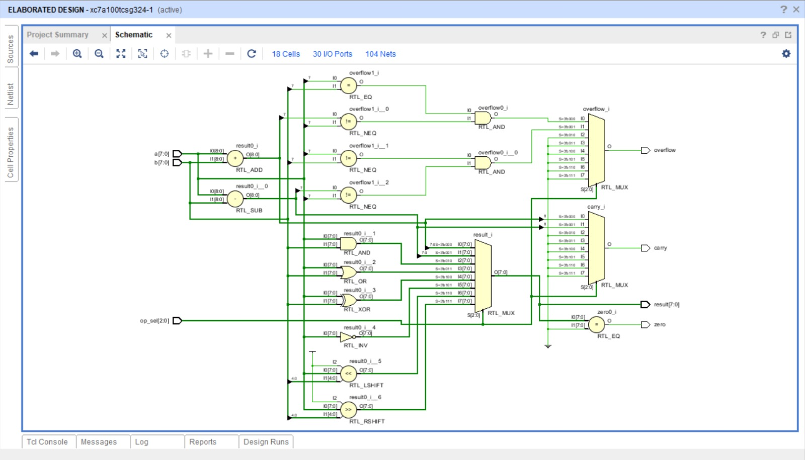

# 8-bit Arithmetic Logic Unit (ALU)

This project implements an **8-bit Arithmetic Logic Unit (ALU)** in SystemVerilog.  
The ALU supports **arithmetic, logical, and shift operations** with status flag outputs (Zero, Carry, Overflow).  

---

##  Features
- 8-bit signed inputs `a` and `b`
- 3-bit operation select (`op_sel`)
- Supported operations:
  - ADD, SUB, AND, OR, XOR, NOT, SLL (Shift Left Logical), SRL (Shift Right Logical)
- Status flags:
  - **Zero** – High if the result is `0`
  - **Carry** – Indicates carry/borrow for ADD/SUB
  - **Overflow** – Detects signed arithmetic overflow

---
## Top Module:

 

## Truth Table for all 8 operations 

| S2 S1 S0 | Operation | Result   | Carry    | Overflow                                    | Zero        |
|----------|-----------|----------|----------|---------------------------------------------|-------------|
| 000      | ADD       | A + B    | Sum[8]   | (A[7] == B[7]) && (Result[7] != A[7])       | Result = 0  |
| 001      | SUB       | A - B    | Diff[8]  | (A[7] != B[7]) && (Result[7] != A[7])       | Result = 0  |
| 010      | AND       | A & B    | 0        | 0                                           | Result = 0  |
| 011      | OR        | A \| B   | 0        | 0                                           | Result = 0  |
| 100      | XOR       | A ^ B    | 0        | 0                                           | Result = 0  |
| 101      | NOT       | ~A       | 0        | 0                                           | Result = 0  |
| 110      | SLL       | A << 4   | 0        | 0                                           | Result = 0  |
| 111      | SRL       | A >> 4   | 0        | 0                                           | Result = 0  |

---
## ALU testbench verification:

---

## Vivado simultaion
