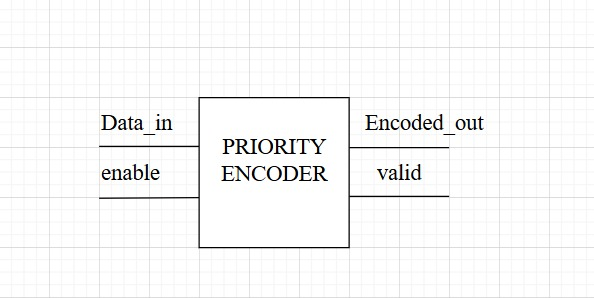
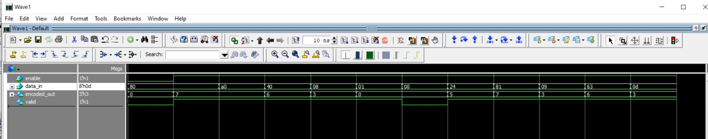
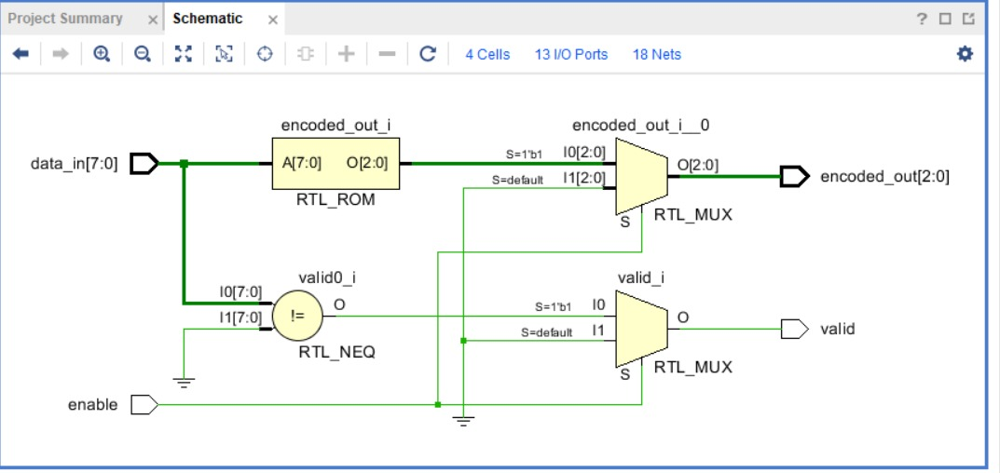

# 8-to-3 Priority Encoder (with Enable)

This module implements an **8-to-3 Priority Encoder** with an **Enable** input.  
- If multiple inputs are active, the encoder outputs the **highest-priority input index** in binary.  
- Priority: **In7 > In6 > In5 > In4 > In3 > In2 > In1 > In0**.  
- The **Enable (En)** signal controls whether the encoder is active or not.  
- A **Valid flag** (not shown in this table) can also be derived to check if any input is active.  

---

##  Features
- Encodes **8 inputs into 3-bit binary** output
- **Priority order:** Input7 (highest) → Input0 (lowest)
- If no input is active → `valid = 0`
- If encoder is disabled (`enable=0`) → output is `000`, `valid=0`

---
## Top Module

---

##  Truth Table

| In0 | In1 | In2 | In3 | In4 | In5 | In6 | In7 | Out1 | Out2 | Out3 | En |
|-----|-----|-----|-----|-----|-----|-----|-----|------|------|------|----|
| 0   | 0   | 0   | 0   | 0   | 0   | 0   | 1   | 0    | 0    | 0    | 1  |
| 0   | 0   | 0   | 0   | 0   | 0   | 1   | X   | 0    | 0    | 1    | 1  |
| 0   | 0   | 0   | 0   | 0   | 1   | X   | X   | 0    | 1    | 0    | 1  |
| 0   | 0   | 0   | 0   | 1   | X   | X   | X   | 0    | 1    | 1    | 1  |
| 0   | 0   | 0   | 1   | X   | X   | X   | X   | 1    | 0    | 0    | 1  |
| 0   | 0   | 1   | X   | X   | X   | X   | X   | 1    | 0    | 1    | 1  |
| 0   | 1   | X   | X   | X   | X   | X   | X   | 1    | 1    | 0    | 1  |
| 1   | X   | X   | X   | X   | X   | X   | X   | 1    | 1    | 1    | 1  |
| 0   | 0   | 0   | 0   | 0   | 0   | 0   | 0   | X    | X    | X    | 1  |
| X   | X   | X   | X   | X   | X   | X   | X   | X    | X    | X    | 0  |

---
## Priority encoder testbench verification

---

## Vivado simultaion

