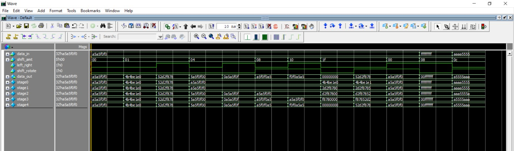
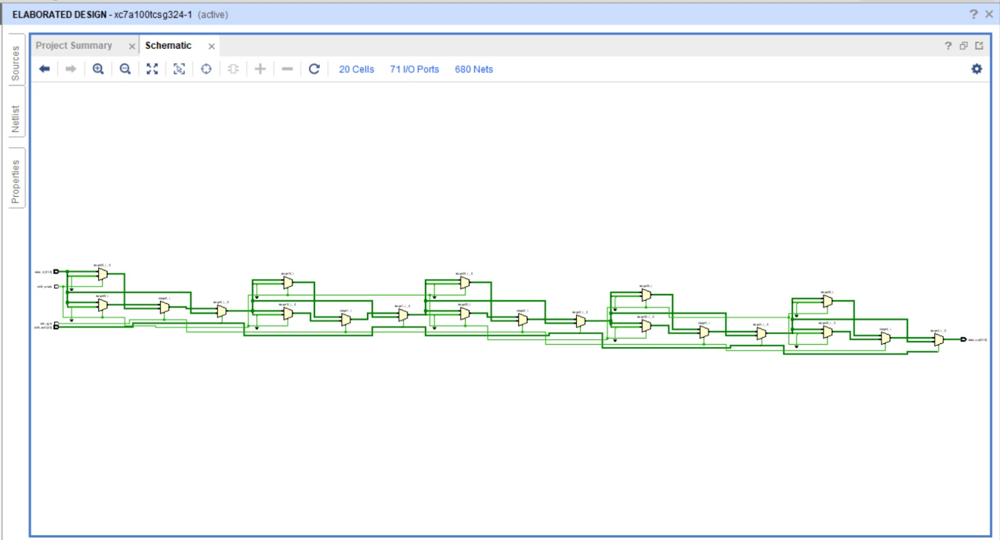

# 32-bit Barrel Shifter

This module implements a **32-bit Barrel Shifter** in SystemVerilog.  
A barrel shifter can shift or rotate data by a specified number of bit positions in a **single clock cycle** (combinational).  

---

##  Features
- Input: `data_in [31:0]` → 32-bit data to be shifted/rotated  
- Input: `shift_amt [4:0]` → Shift/rotate amount (0–31)  
- Input: `left_right` → Select direction  
  - `0` = Left  
  - `1` = Right  
- Input: `shift_rotate` → Select operation type  
  - `0` = Shift (fill with 0s)  
  - `1` = Rotate (wrap-around)  
- Output: `data_out [31:0]` → Result after shift/rotate  

---
## Top module :

 

---
##  Testbench Verification

 

---

## Vivado simultaion
