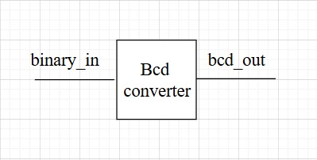
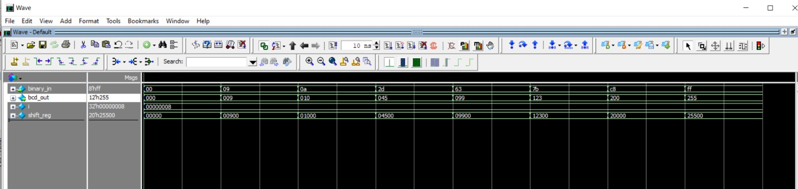
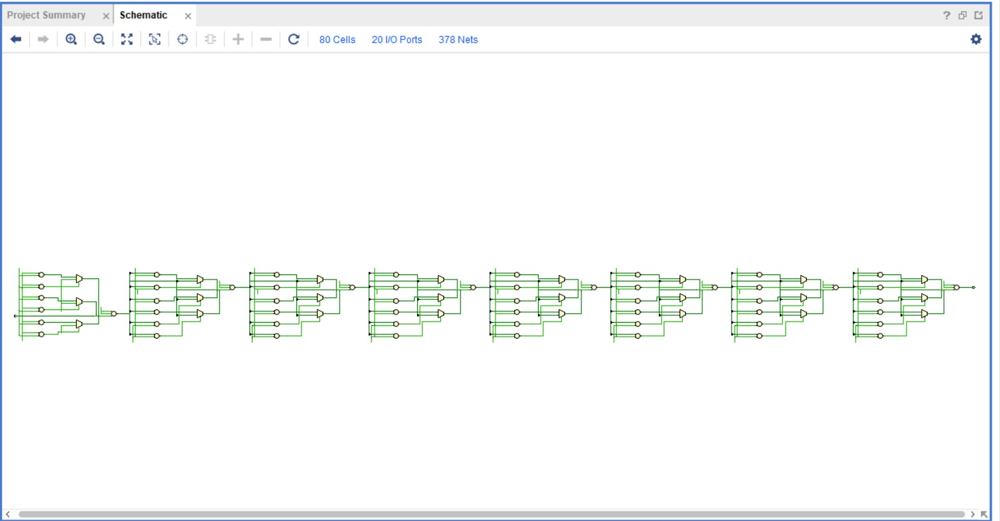

# 8-bit Binary to BCD Converter

This module converts an **8-bit binary number (0–255)** into its **BCD (Binary-Coded Decimal)** representation.  
The output is a 12-bit BCD value consisting of **hundreds, tens, and ones** digits.  

It uses the **shift-and-add-3 algorithm (Double Dabble method)**, which is commonly used in hardware because it is simple and efficient.

---

##  Features
- Input: `binary_in [7:0]` → 8-bit binary (0–255)
- Output: `bcd_out [11:0]` → 3-digit BCD (`{hundreds, tens, ones}`)
- Algorithm: **Double Dabble (Shift-and-Add-3)**
- Purely **combinational** logic, no clock required

---
## Top Module:

 

---
##  Testbench Verification
 

---

## Vivado simultaion

