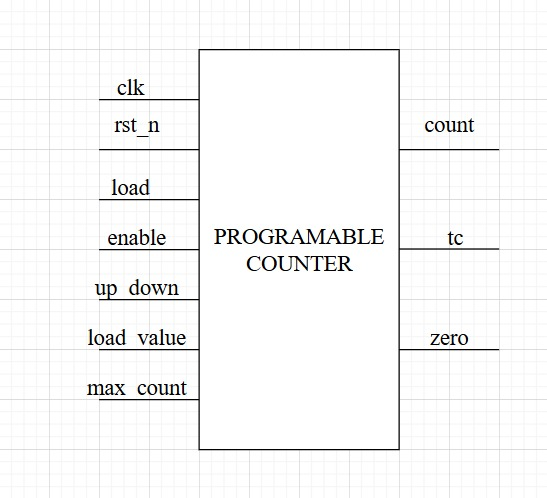
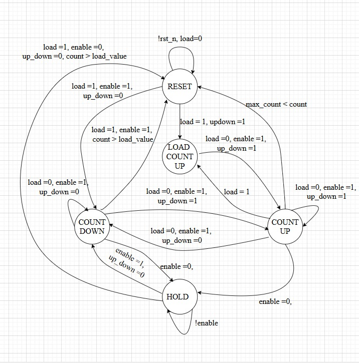
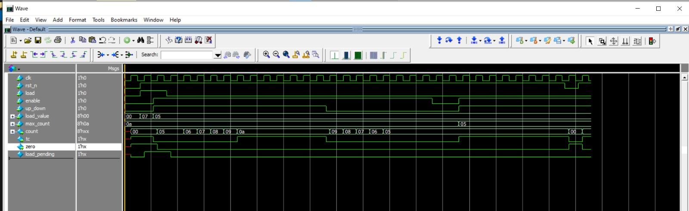
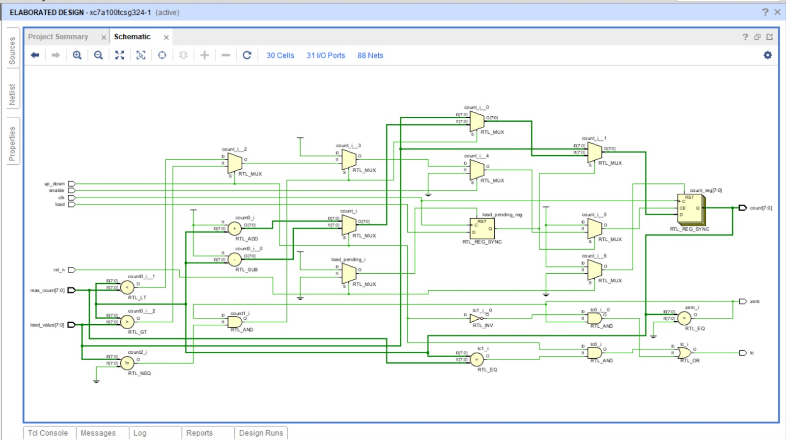

# Programmable Counter

##  Overview

The **programmable_counter** is an 8-bit synchronous counter with the following features:

* **Programmable load value**
* **Programmable maximum count limit**
* **Up/Down counting** (selectable direction)
* **Enable/disable control**
* **Terminal count (TC) and zero detection flags**

It can be used in timer, baud rate generator, event counter, or any digital system requiring programmable counting.

---

##  Features

* Active-low **synchronous reset**
* **Load input** to set a custom value into the counter
* **Enable input** to control counting
* **Up/Down control** for bidirectional counting
* **Max count input** to define programmable upper limit
* Status flags:

  * **tc** → Terminal Count flag (asserted when counter reaches max/zero depending on mode)
  * **zero** → Zero detection flag
---
## Top module of programable counter 

---

##  Port Description

| Port Name    | Direction | Width | Description                                                                         |
| ------------ | --------- | ----- | ----------------------------------------------------------------------------------- |
| `clk`        | Input     | 1     | System clock                                                                        |
| `rst_n`      | Input     | 1     | Active-low synchronous reset                                                        |
| `load`       | Input     | 1     | Load enable signal (counter loads `load_value` on next cycle)                       |
| `enable`     | Input     | 1     | Enables counter operation                                                           |
| `up_down`    | Input     | 1     | Counting direction: `1 = up`, `0 = down`                                            |
| `load_value` | Input     | 8     | Value to load into the counter                                                      |
| `max_count`  | Input     | 8     | Programmable maximum limit for counting                                             |
| `count`      | Output    | 8     | Current counter value                                                               |
| `tc`         | Output    | 1     | Terminal Count flag (`count == max_count` in up mode, or `count == 0` in down mode) |
| `zero`       | Output    | 1     | Zero detection flag (`count == 0`)                                                  |

---
## Top module of programable counter 

---
##  Functional Description

1. **Reset (`rst_n=0`)**

   * Counter resets to `0`.

2. **Load Operation (`load=1`)**

   * The counter captures `load_value` in the **next clock cycle**.

3. **Counting**

   * If `enable=1` and no load is pending:

     * **Up mode (`up_down=1`)** → Counter increments until `max_count`.
     * **Down mode (`up_down=0`)** → Counter decrements until `0`.

4. **Flags**

   * `tc` (Terminal Count) → High when counter reaches `max_count` in **up mode**, or `0` in **down mode**.
   * `zero` → High whenever counter value is `0`.

---
## Testbench Verification of module 

---
---
## Vivado simulation 

