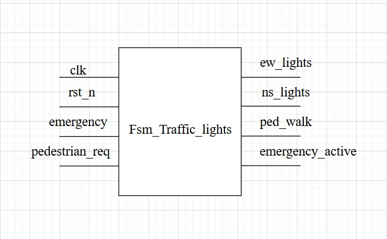
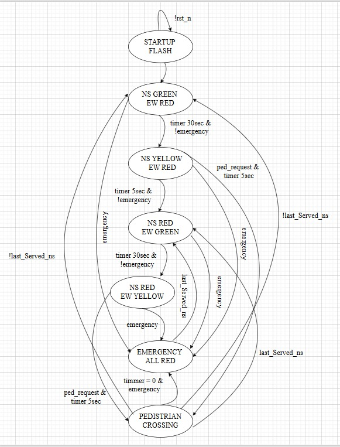
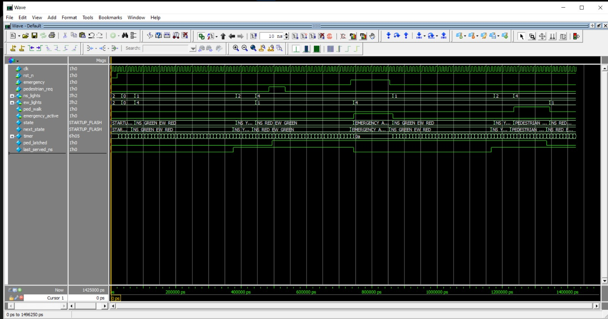
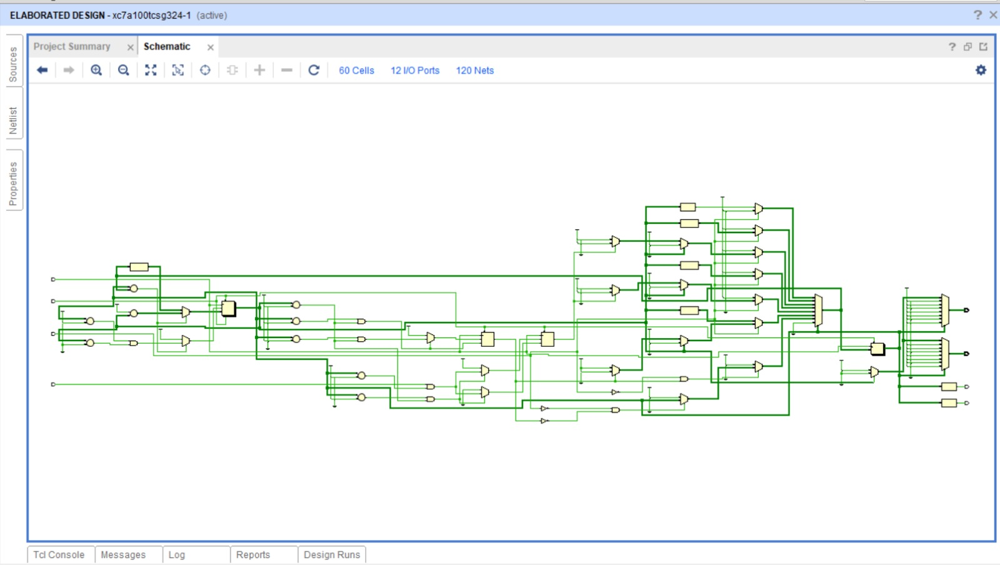

#  Traffic Light Controller (SystemVerilog)

##  Overview
This project implements a **finite state machine (FSM)**-based traffic light controller in **SystemVerilog**.  
It controls **North-South (NS)** and **East-West (EW)** traffic lights, supports **pedestrian requests**, and includes **emergency override mode**.  
The controller runs on a **1 Hz clock** (1 second per tick) to simulate real-time durations.

---
##  Fsm top module

---
##  Features
- **Startup Flashing Mode** – Both directions flash Yellow for 5s after reset.  
- **Normal Operation**  
  - NS Green → NS Yellow → EW Green → EW Yellow (cyclic).  
  - Green = 30s, Yellow = 5s.  
- **Pedestrian Request**  
  - Pedestrian button is latched until served.  
  - Both NS & EW → Red, Pedestrian Walk = ON for 10s.  
  - Traffic resumes from opposite side.  
- **Emergency Mode**  
  - All lights → Red during emergency.  
  - On recovery, resumes from opposite direction of last Green.  

---

##  I/O Description

### Inputs
- `clk` →  clock  
- `rst_n` → Active-low reset  
- `emergency` → Emergency override (forces all Red)  
- `pedestrian_req` → Pedestrian crossing button  

### Outputs
- `ns_lights[2:0]` → NS traffic lights (`[Red, Yellow, Green]`)  
- `ew_lights[2:0]` → EW traffic lights (`[Red, Yellow, Green]`)  
- `ped_walk` → Pedestrian walk signal  
- `emergency_active` → High when in emergency state  

---

##  State Transition Table

| Current State        | Emergency | Ped Request | Next State           | Output Logic                         |
|----------------------|-----------|-------------|----------------------|--------------------------------------|
| STARTUP_FLASH        | 1         | 0           | EMERGENCY_ALL_RED    | All Red                              |
| STARTUP_FLASH        | 0         | 0           | NS_GREEN_EW_RED      | NS=Green, EW=Red                     |
| NS_GREEN_EW_RED      | 1         | 0           | EMERGENCY_ALL_RED    | All Red                              |
| NS_GREEN_EW_RED      | 0         | 0           | NS_YELLOW_EW_RED     | NS=Yellow, EW=Red                    |
| NS_YELLOW_EW_RED     | 1         | 0           | EMERGENCY_ALL_RED    | All Red                              |
| NS_YELLOW_EW_RED     | 0         | 1           | PEDESTRIAN_CROSSING  | Pedestrian Walk ON                   |
| NS_YELLOW_EW_RED     | 0         | 0           | NS_RED_EW_GREEN      | NS=Red, EW=Green                     |
| NS_RED_EW_GREEN      | 1         | 0           | EMERGENCY_ALL_RED    | All Red                              |
| NS_RED_EW_GREEN      | 0         | 0           | NS_RED_EW_YELLOW     | NS=Red, EW=Yellow                    |
| NS_RED_EW_YELLOW     | 1         | 0           | EMERGENCY_ALL_RED    | All Red                              |
| NS_RED_EW_YELLOW     | 0         | 1           | PEDESTRIAN_CROSSING  | Pedestrian Walk ON                   |
| NS_RED_EW_YELLOW     | 0         | 0           | NS_GREEN_EW_RED      | NS=Green, EW=Red                     |
| EMERGENCY_ALL_RED    | 0         | 0           | NS_GREEN_EW_RED*     | If `!last_served_ns` → NS Green      |
| EMERGENCY_ALL_RED    | 0         | 0           | NS_RED_EW_GREEN*     | If `last_served_ns` → EW Green       |
| PEDESTRIAN_CROSSING  | 0         | 0           | NS_GREEN_EW_RED*     | If `!last_served_ns` → NS Green      |
| PEDESTRIAN_CROSSING  | 0         | 0           | NS_RED_EW_GREEN*     | If `last_served_ns` → EW Green       |
| PEDESTRIAN_CROSSING  | 1         | 0           | EMERGENCY_ALL_RED    | All Red `if timer =0`                               |

\* `last_served_ns` is a flag that tracks which direction was last Green before interrupt.

---
## State machine
You can also include the FSM diagram image here:  

---

##  Example Operation
1. System powers on → **5s flashing Yellow**.  
2. NS Green (30s) → NS Yellow (5s) → EW Green (30s) → EW Yellow (5s).  
3. If **pedestrian request** occurs → Latches, served after current phase → 10s Walk.  
4. If **emergency** occurs → All Red until cleared.  

---

##  Test bench verification

---
## Vivado simulation
 