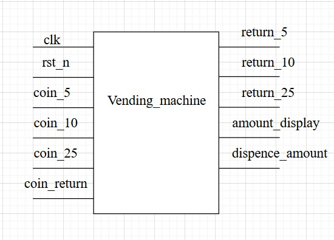
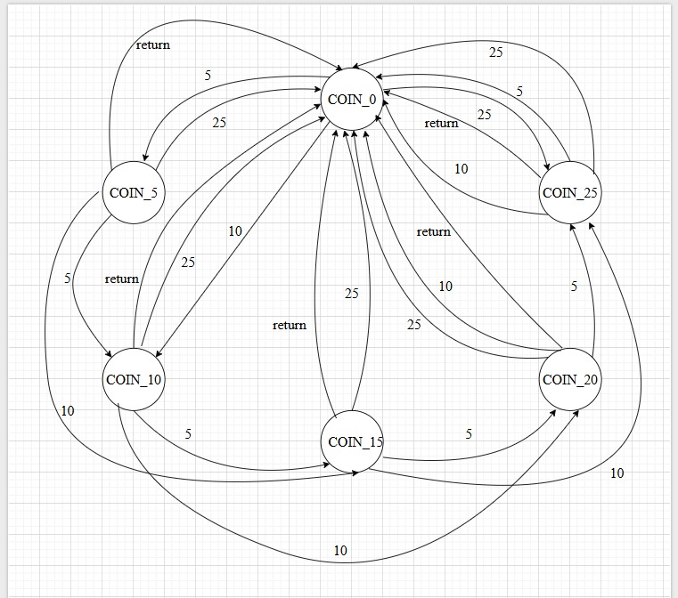
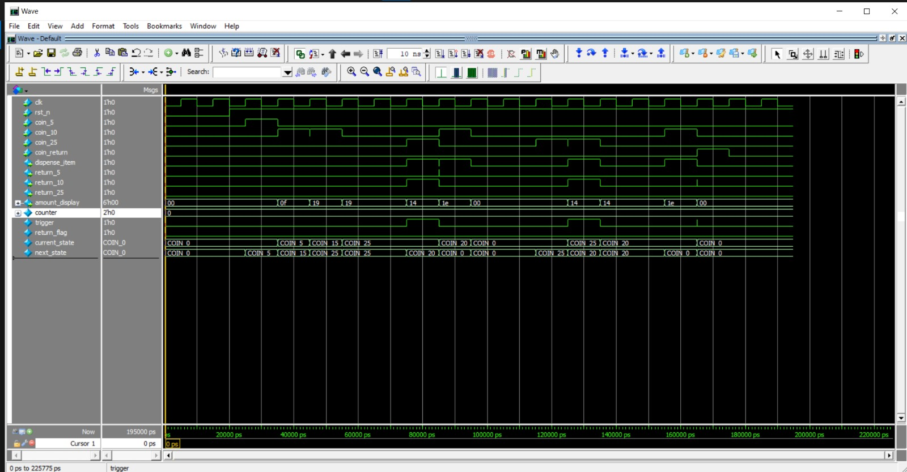
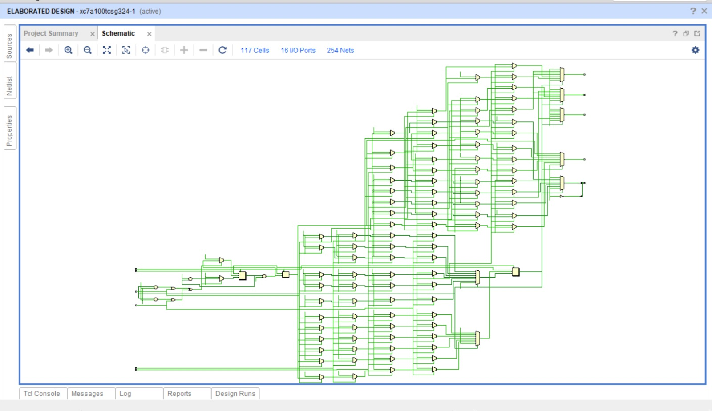

#  Vending Machine FSM (SystemVerilog)

##  Overview
This project implements a **Vending Machine Finite State Machine (FSM)** in SystemVerilog.  
The machine accepts coins of **5¢, 10¢, and 25¢** and dispenses an item worth **30¢**.  
It also supports:
- **Coin Return** (refund feature)
- **Change Return** (when more than 30¢ is inserted)
- **Item Dispense** (on valid amount)
- **Amount Display** (total inserted amount)

---
##  Fsm top module

---

##  Features
- Accepts coins: **5¢, 10¢, 25¢**
- Dispenses item once **30¢ or more** is inserted
- Returns **excess amount as change**
- Handles **coin return button**
- Displays inserted amount (`amount_display`)
- FSM-based state transitions for coin tracking

---
## State machine

---
##  FSM States

The machine keeps track of the total inserted amount using **6 states**:
## Vending Machine FSM Truth Table

| **STATE** | **COIN_5** | **COIN_10** | **COIN_25** | **COIN_RETURN** | **DISPENSE_ITEM** | **RETURN_5** | **RETURN_10** | **RETURN_25** | **AMOUNT_DISPLAY** | **NEXT_STATE** |
|-----------|------------|-------------|-------------|-----------------|-------------------|--------------|---------------|---------------|--------------------|----------------|
| COIN_0    | 1          | 0           | 0           | 0               | 0                 | 0            | 0             | 0             | 5                  | COIN_5         |
| COIN_0    | 0          | 1           | 0           | 0               | 0                 | 0            | 0             | 0             | 10                 | COIN_10        |
| COIN_0    | 0          | 0           | 1           | 0               | 0                 | 0            | 0             | 0             | 25                 | COIN_25        |
| COIN_0    | 0          | 0           | 0           | 1               | 0                 | 0            | 0             | 0             | 0                  | COIN_0         |
| COIN_5    | 1          | 0           | 0           | 0               | 0                 | 0            | 0             | 0             | 10                 | COIN_10        |
| COIN_5    | 0          | 1           | 0           | 0               | 0                 | 0            | 0             | 0             | 15                 | COIN_15        |
| COIN_5    | 0          | 0           | 1           | 0               | 1                 | 0            | 0             | 0             | 0                  | COIN_0         |
| COIN_5    | 0          | 0           | 0           | 1               | 0                 | 1            | 0             | 0             | 0                  | COIN_0         |
| COIN_10   | 1          | 0           | 0           | 0               | 0                 | 0            | 0             | 0             | 15                 | COIN_15        |
| COIN_10   | 0          | 1           | 0           | 0               | 0                 | 0            | 0             | 0             | 20                 | COIN_20        |
| COIN_10   | 0          | 0           | 1           | 0               | 1                 | 1            | 0             | 0             | 0                  | COIN_0         |
| COIN_10   | 0          | 0           | 0           | 1               | 0                 | 0            | 1             | 0             | 0                  | COIN_0         |
| COIN_15   | 1          | 0           | 0           | 0               | 0                 | 0            | 0             | 0             | 20                 | COIN_20        |
| COIN_15   | 0          | 1           | 0           | 0               | 0                 | 0            | 0             | 0             | 25                 | COIN_25        |
| COIN_15   | 0          | 0           | 1           | 0               | 1                 | 0            | 1             | 0             | 0                  | COIN_0         |
| COIN_15   | 0          | 0           | 0           | 1               | 0                 | 1            | 1             | 0             | 0                  | COIN_0         |
| COIN_20   | 1          | 0           | 0           | 0               | 0                 | 0            | 0             | 0             | 25                 | COIN_25        |
| COIN_20   | 0          | 1           | 0           | 0               | 1                 | 0            | 0             | 0             | 0                  | COIN_0         |
| COIN_20   | 0          | 0           | 1           | 0               | 1                 | 1            | 1             | 0             | 0                  | COIN_0         |
| COIN_20   | 0          | 0           | 0           | 1               | 0                 | 0            | 2             | 0             | 0                  | COIN_0         |
| COIN_25   | 1          | 0           | 0           | 0               | 1                 | 0            | 0             | 0             | 0                  | COIN_0         |
| COIN_25   | 0          | 1           | 0           | 0               | 1                 | 1            | 0             | 0             | 0                  | COIN_0         |
| COIN_25   | 0          | 0           | 1           | 0               | 1                 | 0            | 2             | 0             | 0                  | COIN_0         |
| COIN_25   | 0          | 0           | 0           | 1               | 0                 | 0            | 0             | 1             | 0                  | COIN_0         |

---

##  Working
1. **Coin Insertion**
   - User inserts coins (5¢, 10¢, 25¢).
   - FSM transitions to the next state based on total amount.

2. **Dispensing Item**
   - If the sum reaches **30¢**, the machine **dispenses an item**.
   - If extra coins are inserted, the FSM **returns change**.

3. **Change Return**
   - Example: Inserting 25¢ + 10¢ (35¢) → Item dispensed + **5¢ returned**.  
   - Example: Inserting 25¢ + 25¢ (50¢) → Item dispensed + **20¢ returned**.

4. **Coin Return**
   - At any time, pressing the **coin_return** button refunds the current balance.

5. **Display**
   - `amount_display` shows the total money inserted until reset or item dispense.

---

##  Vending Machine verification:
 

---
##  Vending Machine verification:
 

---