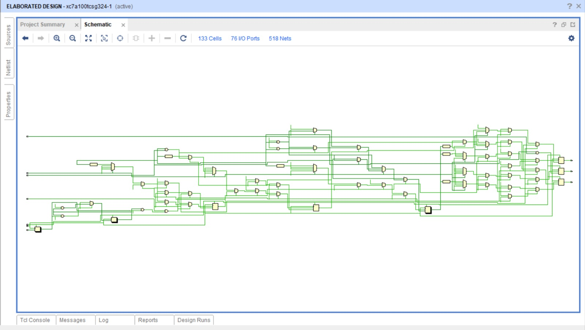

#  Timer Module (Verilog)

##  Overview

This module implements a **configurable timer** with support for:

* **One-shot mode**
* **Periodic mode**
* **PWM mode**
* **Prescaler support**

It provides **timeout, PWM output, and interrupt signals** for use in digital systems such as processors, microcontrollers, and FPGA designs.

---

##  Multimode timer top module:
 

---

##  Features

* **Modes of operation**

  * `00` → One-shot (counts down once, then stops)
  * `01` → Periodic (auto-reload from `load` value)
  * `10` → PWM (up/down counter for duty cycle generation)

* **Prescaler (0–15)**

  * Divides input clock before feeding the timer counter

* **Interrupt & Timeout**

  * Generates signals when the counter reaches terminal values

* **PWM Output**

  * Adjustable duty cycle based on `compare` value

---

##  Inputs

| Signal     | Width  | Description                                       |
| ---------- | ------ | ------------------------------------------------- |
| `clk`      | 1-bit  | Input clock                    |
| `reset`    | 1-bit  | Active-high reset                                 |
| `enable`   | 1-bit  | Enable timer                                      |
| `mode`     | 2-bit  | Operating mode (00=One-shot, 01=Periodic, 10=PWM) |
| `load`     | 32-bit | Load value for counter                            |
| `compare`  | 32-bit | Compare value for PWM duty cycle                  |
| `prescale` | 4-bit  | Prescaler value (0–15)                            |

---

##  Outputs

| Signal      | Width | Description               |
| ----------- | ----- | ------------------------- |
| `timeout`   | 1-bit | High when timer expires   |
| `pwm_out`   | 1-bit | PWM output signal         |
| `interrupt` | 1-bit | Interrupt flag on timeout |

---

##  Internal Registers

* **`counter`** → Main countdown/up counter
* **`prescale_counter`** → Prescaler counter
* **`prescale_value`** → Holds prescaler setting
* **`running`** → Timer running state flag
* **`pwm_direction`** → Controls up/down counting in PWM mode

---

##  Operation

### 1. Prescaler Logic

* Divides the clock using `prescale`
* Generates a `clock_enable` pulse when counter matches `prescale`

### 2. One-Shot Mode (`mode = 00`)

* Loads `counter` with `load` value
* Counts down to `0`
* Asserts `timeout` & `interrupt` once, then stops

### 3. Periodic Mode (`mode = 01`)

* Counts down from `load` to `0`
* On reaching `0`:

  * Sets `timeout` & `interrupt`
  * Reloads counter from `load`
* Repeats continuously

### 4. PWM Mode (`mode = 10`)

* Uses **up/down counting** between `0` and `load`
* Toggles `pwm_direction` when hitting boundaries
* `pwm_out = 1` when `counter < compare` (duty cycle control)
* Generates `timeout` & `interrupt` at boundaries

---

##  Example Use-Cases

* **One-shot:** Delay generator or watchdog timeout
* **Periodic:** Real-time clock tick or periodic interrupt source
* **PWM:** Motor control, LED dimming, or DAC output

---

##  Multimode timer verification:
 

---
## Vivado simulation Multimode timer verification:
 
