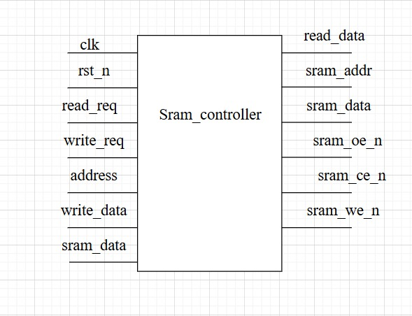
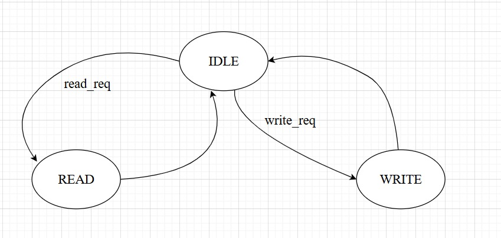
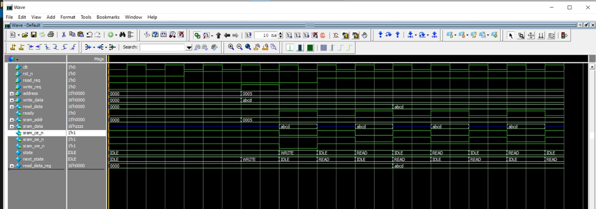
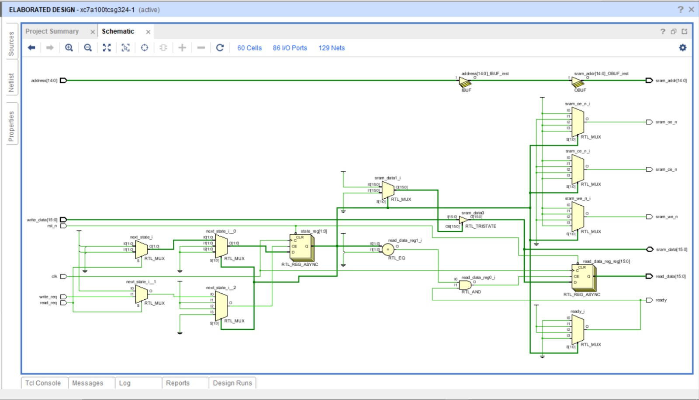

#  SRAM Controller

##  Overview

The **SRAM Controller** provides an interface between a digital system (e.g., CPU or FPGA logic) and an **asynchronous SRAM** device.
It handles

* Read & Write requests
* Address and data multiplexing
* Control signals for chip enable, output enable, and write enable
* Data bus direction management (inout handling)

---

##  Fsm top module

---

##  Features

* Supports **16-bit wide SRAM** with **15-bit address bus**
* Simple **request/ready handshake**
* Finite State Machine (FSM) with **IDLE, READ, WRITE** states
* Tri-stated bidirectional data bus handling
* Read data is **latched** to ensure stability

---

## State Transition table:

---

##  Port Description

| Port Name    | Direction | Width | Description                           |
| ------------ | --------- | ----- | ------------------------------------- |
| `clk`        | Input     | 1     | System clock                          |
| `rst_n`      | Input     | 1     | Active-low reset                      |
| `read_req`   | Input     | 1     | Read request signal                   |
| `write_req`  | Input     | 1     | Write request signal                  |
| `address`    | Input     | 15    | SRAM address                          |
| `write_data` | Input     | 16    | Data to be written to SRAM            |
| `read_data`  | Output    | 16    | Data read from SRAM                   |
| `ready`      | Output    | 1     | Operation complete flag               |
| `sram_addr`  | Output    | 15    | Address bus to SRAM                   |
| `sram_data`  | Inout     | 16    | Bidirectional data bus to/from SRAM   |
| `sram_ce_n`  | Output    | 1     | Chip Enable (active low)              |
| `sram_oe_n`  | Output    | 1     | Output Enable (active low, read mode) |
| `sram_we_n`  | Output    | 1     | Write Enable (active low, write mode) |

---

##  Functional Description

### 1. Reset

* When `rst_n = 0`, FSM goes to **IDLE** state, `read_data` is cleared.

### 2. Read Operation

* Triggered when `read_req = 1`.
* FSM transitions to **READ** state.
* Controller drives:

  * `sram_ce_n = 0`, `sram_oe_n = 0`, `sram_we_n = 1`.
* `sram_data` is read from external memory and latched into `read_data`.
* `ready = 1` for one cycle.
* FSM returns to **IDLE**.

### 3. Write Operation

* Triggered when `write_req = 1`.
* FSM transitions to **WRITE** state.
* Controller drives:

  * `sram_ce_n = 0`, `sram_oe_n = 1`, `sram_we_n = 0`.
* `sram_data` bus drives `write_data`.
* `ready = 1` for one cycle.
* FSM returns to **IDLE**.

---
## Testbench verification module

---

## Vivado simulation

---