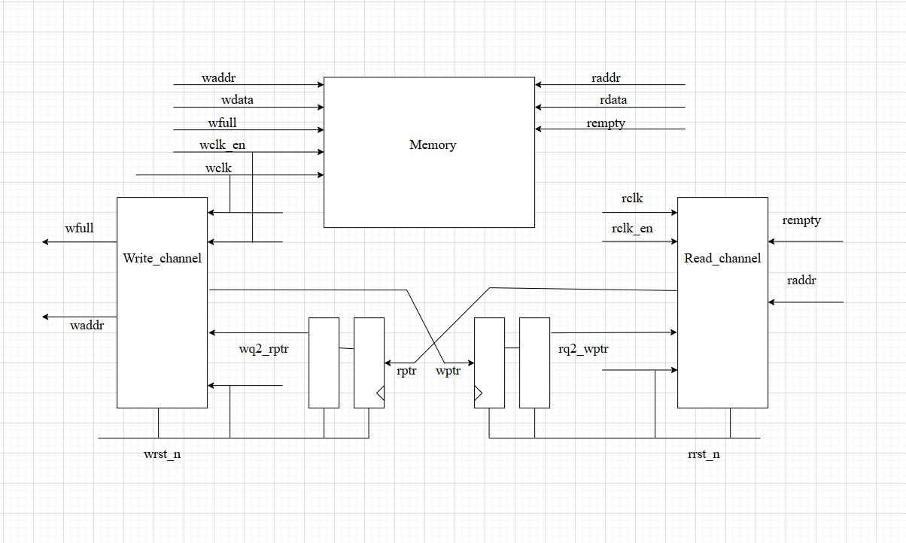
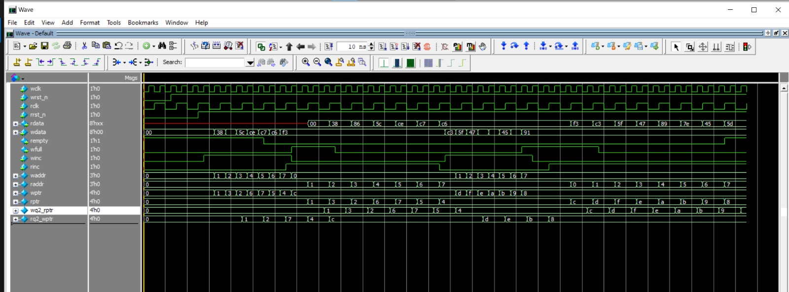
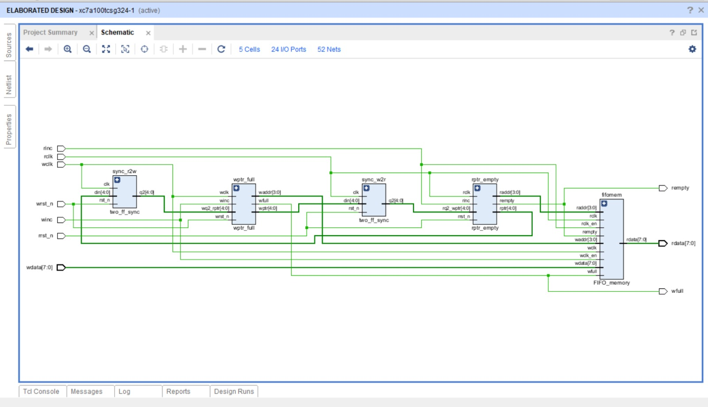

#  Asynchronous FIFO Design

##  Overview

This project implements an **Asynchronous FIFO (First-In-First-Out) buffer**.
It is used for **clock domain crossing (CDC)**, where data written in one clock domain must be safely read in another.

The design ensures **data integrity** by using:

* **Gray-coded read/write pointers** → prevent glitches
* **Two-flop synchronizers** → reduce metastability
* **Empty & Full flag logic** → prevent underflow/overflow
* **Dual-port memory** → supports independent read and write

---

##  Asynchronous fifo top module: 

---

##  Modules

### 1 `FIFO_memory`

* **Function:** Stores the actual FIFO data
* **Key Features:**

  * Dual-port memory (separate read/write)
  * Depth = `2^ADDR_SIZE`
  * Prevents writes when full (`wfull`)
  * Prevents reads when empty (`rempty`)

**Ports:**

* `wdata` → Input data for write
* `rdata` → Output data for read
* `waddr`, `raddr` → Write and read addresses
* `wclk_en`, `wclk`, `wfull` → Write control
* `rempty` → Read control

---

### 2 `rptr_empty`

* **Function:** Handles **read pointer** logic & **empty flag** generation
* **Key Features:**

  * Maintains **binary read pointer (`rbin`)** and **Gray-coded pointer (`rptr`)**
  * Compares **read pointer** with synchronized write pointer (`rq2_wptr`)
  * Asserts `rempty = 1` when FIFO has no data

**Ports:**

* `raddr` → Read address for memory
* `rptr` → Gray-coded read pointer
* `rq2_wptr` → Synchronized write pointer (Gray code)
* `rempty` → Empty flag
* `rinc`, `rclk`, `rrst_n` → Read increment, clock, reset

---

### 3 `wptr_full`

* **Function:** Handles **write pointer** logic & **full flag** generation
* **Key Features:**

  * Maintains **binary write pointer (`wbin`)** and **Gray-coded pointer (`wptr`)**
  * Compares **write pointer** with synchronized read pointer (`wq2_rptr`)
  * Asserts `wfull = 1` when FIFO has no space left

**Ports:**

* `waddr` → Write address for memory
* `wptr` → Gray-coded write pointer
* `wq2_rptr` → Synchronized read pointer (Gray code)
* `wfull` → Full flag
* `winc`, `wclk`, `wrst_n` → Write increment, clock, reset

---

### 4 `two_ff_sync`

* **Function:** Synchronizes pointers across clock domains
* **Key Features:**

  * Implements **2-stage flip-flop synchronizer**
  * Prevents metastability when passing Gray-coded pointers between domains

**Ports:**

* `din` → Input data (pointer to be synchronized)
* `q2` → Stable synchronized output
* `clk`, `rst_n` → Synchronizer clock and reset

---

##  How It Works (System Flow)

1. **Write Side (wclk domain):**

   * `wptr_full` generates `wptr` and `waddr`
   * `FIFO_memory` writes data at `waddr` if `winc=1` and `!wfull`
   * `wptr` (Gray) is synchronized to read domain using `two_ff_sync`

2. **Read Side (rclk domain):**

   * `rptr_empty` generates `rptr` and `raddr`
   * `FIFO_memory` provides data from `raddr` if `!rempty`
   * `rptr` (Gray) is synchronized to write domain using `two_ff_sync`

3. **Empty & Full Detection:**

   * `rempty` asserted if next read pointer == synchronized write pointer
   * `wfull` asserted if next write pointer == synchronized read pointer (special Gray condition)

---

## Module verification

---
## Vivado simulation

---

