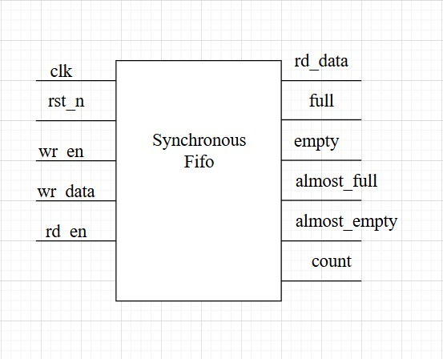
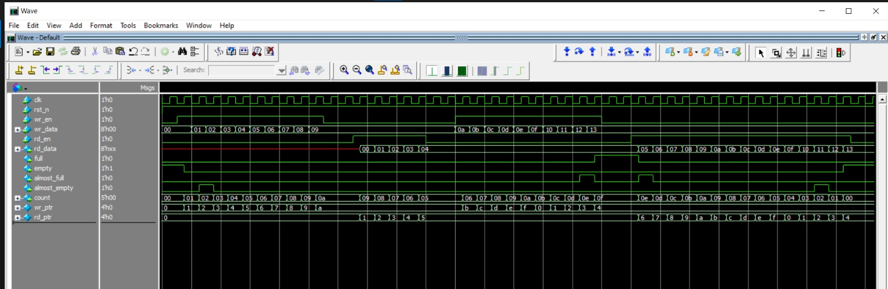
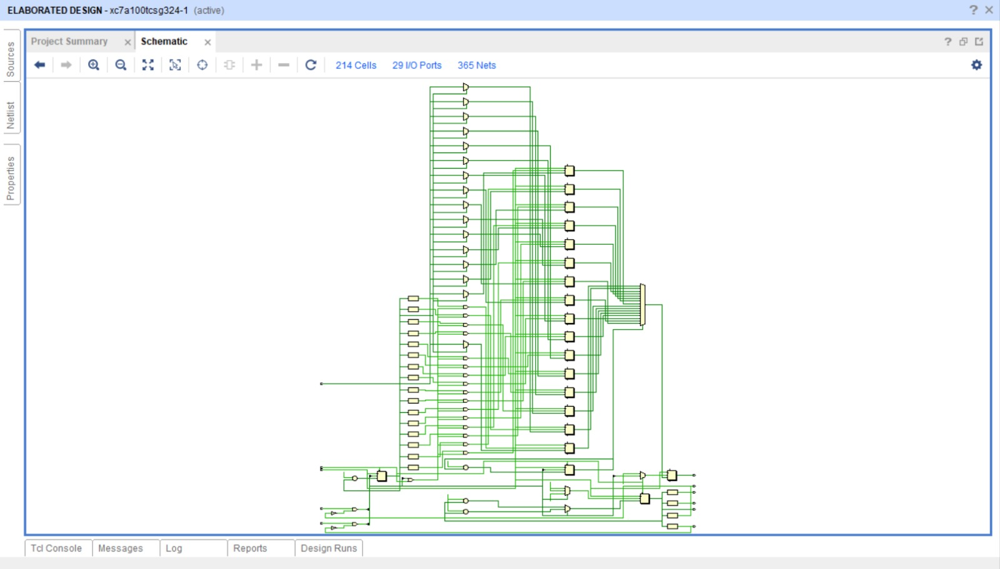

# Synchronous FIFO (sync\_fifo)

##  Overview

This module implements a **synchronous FIFO (First-In-First-Out) buffer**.
It supports **parameterizable data width and depth**, and provides status flags for **full, empty, almost full, and almost empty** conditions.

The FIFO allows **single-clock synchronous write and read operations**, making it suitable for buffering data between producer and consumer logic inside the same clock domain.

---
##  Synchronous fifo top module:
 

---
##  Features

* **Configurable parameters**

  * `DATA_WIDTH` → Width of stored data (default: 8 bits)
  * `FIFO_DEPTH` → Depth of FIFO (default: 16 entries)
  * `ALMOST_FULL_THRESH` → Threshold for almost full flag (default: 14)
  * `ALMOST_EMPTY_THRESH` → Threshold for almost empty flag (default: 2)

* **Status flags**

  * `full` → FIFO cannot accept more data
  * `empty` → No data available for read
  * `almost_full` → FIFO is near capacity
  * `almost_empty` → FIFO is nearly drained

* **Count tracking** → Maintains number of stored elements

* **Safe operation** → Prevents writes when full, prevents reads when empty

---

##  Inputs

| Signal    | Width             | Description          |
| --------- | ----------------- | -------------------- |
| `clk`     | 1-bit             | System clock         |
| `rst_n`   | 1-bit             | Active-low reset     |
| `wr_en`   | 1-bit             | Write enable         |
| `wr_data` | `DATA_WIDTH` bits | Data input for write |
| `rd_en`   | 1-bit             | Read enable          |

---

##  Outputs

| Signal         | Width                     | Description                          |
| -------------- | ------------------------- | ------------------------------------ |
| `rd_data`      | `DATA_WIDTH` bits         | Data output on read                  |
| `full`         | 1-bit                     | Asserted when FIFO is full           |
| `empty`        | 1-bit                     | Asserted when FIFO is empty          |
| `almost_full`  | 1-bit                     | Asserted when FIFO usage ≥ threshold |
| `almost_empty` | 1-bit                     | Asserted when FIFO usage ≤ threshold |
| `count`        | `log2(FIFO_DEPTH)+1` bits | Current number of stored entries     |

---

##  Internal Registers

* **`fifo[]`** → Memory array for storing data
* **`wr_ptr`** → Write pointer
* **`rd_ptr`** → Read pointer
* **`count`** → Current fill level

---

##  Operation

### 1. Write Operation

* If `wr_en = 1` and FIFO is **not full**:

  * Data from `wr_data` is stored at `fifo[wr_ptr]`
  * `wr_ptr` increments

### 2. Read Operation

* If `rd_en = 1` and FIFO is **not empty**:

  * Data at `fifo[rd_ptr]` is assigned to `rd_data`
  * `rd_ptr` increments

### 3. Count Logic

* If **write only** → `count` increases
* If **read only** → `count` decreases
* If **read & write together** → `count` unchanged

### 4. Status Flags

* **Full** → `count == FIFO_DEPTH - 1`
* **Empty** → `count == 0`
* **Almost Full** → `count == ALMOST_FULL_THRESH`
* **Almost Empty** → `count == ALMOST_EMPTY_THRESH`

---
## Testbench verification of module

## Vivado simulation

