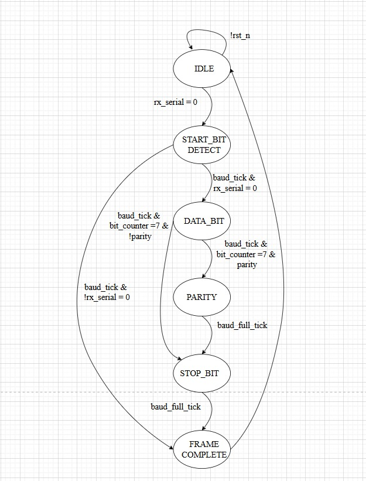
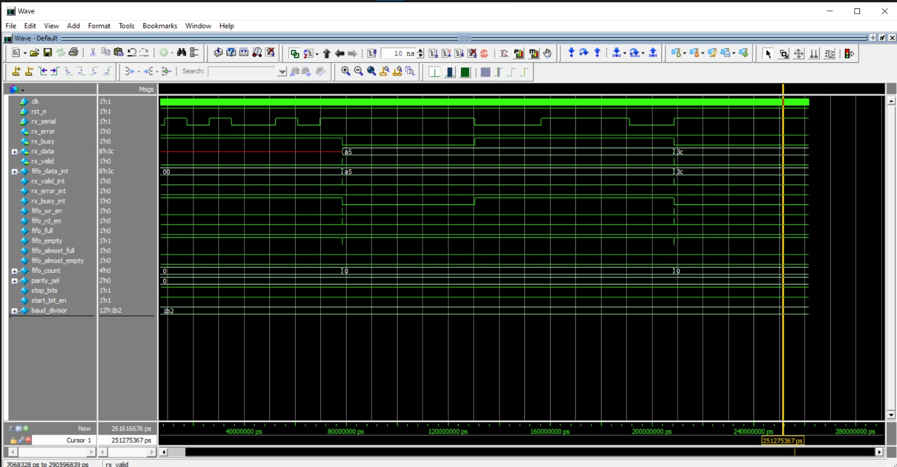
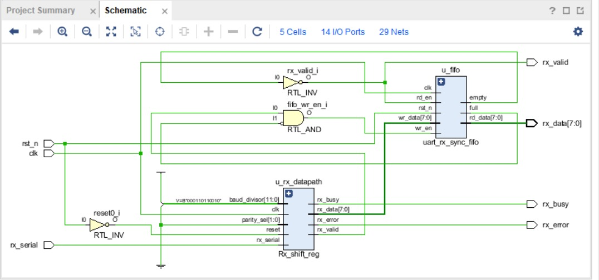

# UART RX Datapath

##  Overview

The **`uart_rx_datapath`** module integrates the UART **receiver shift register** (`Rx_shift_reg`) with a **synchronous FIFO** (`uart_rx_sync_fifo`).
It provides a complete datapath for receiving serial data, handling **start/stop/parity checks**, buffering received bytes, and making them available for higher-level logic.

---

##  Parameters

| Parameter             | Default      | Description                                  |
| --------------------- | ------------ | -------------------------------------------- |
| `CLK_FREQ`            | 50\_000\_000 | System clock frequency in Hz (e.g., 50 MHz). |
| `BAUD_RATE`           | Configurable | Baud rate for UART communication.            |
| `FIFO_DEPTH`          | 8            | Number of entries in the FIFO buffer.        |
| `DATA_WIDTH`          | 8            | Width of each data word (8 bits for UART).   |
| `ALMOST_FULL_THRESH`  | 6            | Threshold for asserting `fifo_almost_full`.  |
| `ALMOST_EMPTY_THRESH` | 2            | Threshold for asserting `fifo_almost_empty`. |

---

##  Ports

| Port        | Direction | Width | Description                                                |
| ----------- | --------- | ----- | ---------------------------------------------------------- |
| `clk`       | Input     | 1     | System clock.                                              |
| `rst_n`     | Input     | 1     | Active-low reset.                                          |
| `rx_serial` | Input     | 1     | Incoming UART serial data line.                            |
| `rx_error`  | Output    | 1     | Error flag (set on parity or framing error).               |
| `rx_busy`   | Output    | 1     | Indicates receiver is busy processing a frame.             |
| `rx_data`   | Output    | 8     | Received parallel data byte (from FIFO).                   |
| `rx_valid`  | Output    | 1     | Asserted when valid data is available in FIFO (not empty). |

---

##  Internal Functionality

1. **Baud Rate Generator**

   * `baud_divisor = CLK_FREQ / BAUD_RATE`
   * Used by `Rx_shift_reg` for sampling incoming serial bits at correct intervals.

2. **Shift Register (`Rx_shift_reg`)**

   * Detects **start bit**, samples **8 data bits**, optionally checks **parity**, and verifies **stop bit**.
   * Outputs received data (`fifo_data_int`), along with **valid**, **busy**, and **error** flags.

3. **FIFO Buffer (`uart_rx_sync_fifo`)**

   * Stores received data bytes until external logic is ready.
   * Provides **flow control** with `full`, `empty`, `almost_full`, `almost_empty`, and `count`.

4. **Control Logic**

   * `fifo_wr_en` asserted when valid data is received and FIFO not full.
   * `fifo_rd_en` asserted whenever FIFO is not empty (continuous data availability).
   * `rx_valid` indicates new data is available (`~fifo_empty`).
   * `rx_data` connected to FIFO read output.
---

#  UART Receiver Shift Register (`Rx_shift_reg`)

##  Overview

The `Rx_shift_reg` is a **UART Receiver** module that performs serial-to-parallel conversion of incoming UART frames.
It supports:

* **Start-bit detection**
* **8-bit data reception (LSB-first)**
* **Optional parity check (even/odd)**
* **Stop-bit verification**
* **Error detection (framing + parity)**

It samples incoming bits at the **center of each baud period** (optimal sampling point).

---
## Finite state machine

---

##  Features

* Parameterized **Clock Frequency (`CLK_FREQ`)** and **Baud Rate (`BAUD_RATE`)**
* Configurable **Parity**:

  * `00` → No parity
  * `01` → Even parity
  * `10` → Odd parity
  * `11` → Reserved (can be used for Mark parity = 1)
* Generates **status flags**:

  * `rx_busy` → Receiver active
  * `rx_valid` → Data word ready
  * `rx_error` → Error (framing/parity)
* **Framing error detection** if stop bit is not `1`
* **Parity error detection** if parity bit mismatches

---

##  Port Description

| Signal         | Direction | Width | Description                                |
| -------------- | --------- | ----- | ------------------------------------------ |
| `clk`          | Input     | 1     | System clock                               |
| `reset`        | Input     | 1     | Active-high reset                          |
| `rx_serial`    | Input     | 1     | Incoming UART serial data                  |
| `baud_divisor` | Input     | 12    | Baud rate divisor (`CLK_FREQ / BAUD_RATE`)      |
| `parity_sel`   | Input     | 2     | Parity mode select                         |
| `rx_data`      | Output    | 8     | Received parallel data                     |
| `rx_valid`     | Output    | 1     | High for one cycle when data is valid      |
| `rx_error`     | Output    | 1     | Error flag (parity or framing)             |
| `rx_busy`      | Output    | 1     | Indicates receiver is active               |

---

##  Internal Operation

### 1. **Baud Generator**

* Generates:

  * `baud_half_tick` → Half bit-period tick (used to sample **start bit**)
  * `baud_full_tick` → Full bit-period tick (used to sample **data/parity/stop bits**)

### 2. **Finite State Machine (FSM)**

* **IDLE**: Wait for `rx_serial = 0` (start bit).
* **START\_BIT\_DETECT**: Sample at middle of start bit (`baud_half_tick`).
* **DATA\_BITS**: Sample 8 data bits (`baud_full_tick`), shift into register.
* **PARITY\_CHECK**: Validate parity if enabled.
* **STOP\_BIT**: Verify stop bit is `1`.
* **FRAME\_COMPLETE**: Latch received data, assert `rx_valid`, check errors.

### 3. **Parity Calculation**

* Uses XOR reduction (`^shift_reg`) for **even parity**.
* Odd parity handled via inversion.

---

* Sampling occurs at **midpoint** of each bit (`baud_half_tick` for start, `baud_full_tick` for others).
* `rx_valid` goes **high for one cycle** after stop bit is received.

---

##  Error Handling

* **Framing Error**: Stop bit not detected as `1`.
* **Parity Error**: Parity mismatch with `rx_serial`.
* Both errors combined into `rx_error`.

---

# UART RX Synchronous FIFO

##  Overview

The **`uart_rx_sync_fifo`** module implements a synchronous FIFO (First-In, First-Out) buffer for UART receiver data handling.
It ensures smooth transfer of received data between asynchronous producer (UART RX shift register) and consumer (CPU/logic).

The FIFO supports:

* Configurable **data width** and **depth**
* **Almost full** / **Almost empty** threshold detection
* Count tracking of stored elements
* Safe **read/write** operations

---

##  Parameters

| Parameter             | Description                                           |
| --------------------- | ----------------------------------------------------- |
| `DATA_WIDTH`          | Width of each data word (e.g., 8 bits for UART data). |
| `FIFO_DEPTH`          | Number of entries the FIFO can hold.                  |
| `ALMOST_FULL_THRESH`  | Threshold at which `almost_full` signal is asserted.  |
| `ALMOST_EMPTY_THRESH` | Threshold at which `almost_empty` signal is asserted. |

---

##  Ports

| Port           | Direction | Width                  | Description                                       |
| -------------- | --------- | ---------------------- | ------------------------------------------------- |
| `clk`          | Input     | 1                      | System clock (synchronous FIFO operation).        |
| `rst_n`        | Input     | 1                      | Active-low reset.                                 |
| `wr_en`        | Input     | 1                      | Write enable (data pushed into FIFO).             |
| `wr_data`      | Input     | `DATA_WIDTH`           | Data input for writing.                           |
| `rd_en`        | Input     | 1                      | Read enable (data popped from FIFO).              |
| `rd_data`      | Output    | `DATA_WIDTH`           | Data output after read.                           |
| `full`         | Output    | 1                      | FIFO full indicator (cannot write).               |
| `empty`        | Output    | 1                      | FIFO empty indicator (cannot read).               |
| `almost_full`  | Output    | 1                      | FIFO almost full indicator (based on threshold).  |
| `almost_empty` | Output    | 1                      | FIFO almost empty indicator (based on threshold). |
| `count`        | Output    | `$clog2(FIFO_DEPTH)+1` | Number of entries currently stored in FIFO.       |

---

##  Functionality

1. **Write Operation**

   * If `wr_en=1` and `full=0`, the input data `wr_data` is written into the FIFO at `wr_ptr` location.
   * `wr_ptr` increments after a valid write.

2. **Read Operation**

   * If `rd_en=1` and `empty=0`, data is read from FIFO at `rd_ptr` into `rd_data`.
   * `rd_ptr` increments after a valid read.

3. **Count Management**

   * `count` increments on a valid write, decrements on a valid read.
   * If both read & write happen in the same cycle, `count` remains unchanged.

4. **Status Flags**

   * `full` → Asserted when `count == FIFO_DEPTH - 1` (FIFO cannot accept new data).
   * `empty` → Asserted when `count == 0`.
   * `almost_full` → Asserted when `count == ALMOST_FULL_THRESH`.
   * `almost_empty` → Asserted when `count == ALMOST_EMPTY_THRESH`.

---
## Testbench verification of the module

---
## Vivado simulation

---