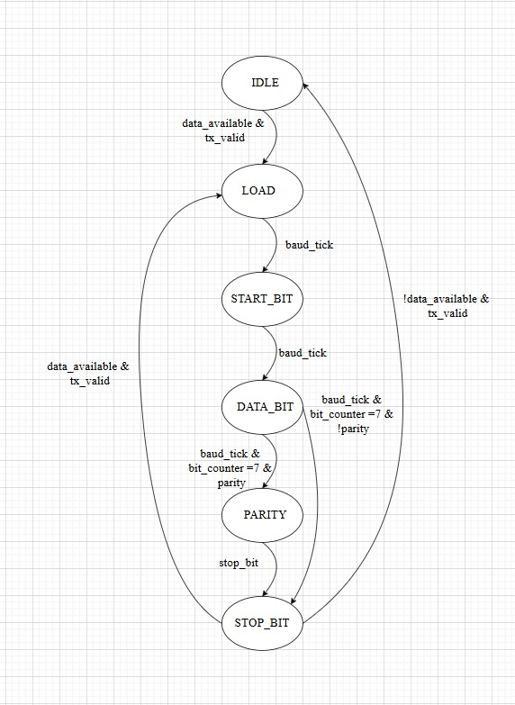

#  UART Transmitter Module

##  Overview

The **`uart_transmitter`** module implements a UART (Universal Asynchronous Receiver Transmitter) transmitter datapath.
It uses an internal **synchronous FIFO buffer** to store outgoing data and a **controller** to handle serial transmission at the configured baud rate.

This design supports **parameterized FIFO depth, data width, and baud rate**.

---

##  Features

* Parameterizable **clock frequency** and **baud rate**.
* **FIFO buffer** for transmit data (depth configurable).
* Generates **start, data, parity, and stop bits**.
* **Flow control** using `tx_ready` and `tx_busy`.
* Supports **parity control** (default: no parity).
* Status outputs for **busy state**.

---

##  Module Parameters

| Parameter             | Default      | Description                     |
| --------------------- | ------------ | ------------------------------- |
| `CLK_FREQ`            | 50\_000\_000 | System clock frequency (Hz).    |
| `BAUD_RATE`           | configurable | UART baud rate.                 |
| `FIFO_DEPTH`          | 8            | FIFO depth for transmit buffer. |
| `DATA_WIDTH`          | 8            | Width of each data word (bits). |
| `ALMOST_FULL_THRESH`  | 6            | FIFO almost full threshold.     |
| `ALMOST_EMPTY_THRESH` | 2            | FIFO almost empty threshold.    |

---

##  Port Description

| Port        | Dir | Width | Description                                    |
| ----------- | --- | ----- | ---------------------------------------------- |
| `clk`       | in  | 1     | System clock.                                  |
| `rst_n`     | in  | 1     | Active-low reset.                              |
| `tx_data`   | in  | 8     | Parallel data input to transmit.               |
| `tx_valid`  | in  | 1     | Indicates `tx_data` is valid.                  |
| `tx_ready`  | out | 1     | High when transmitter is ready to accept data. |
| `tx_serial` | out | 1     | Serial data output (TX line).                  |
| `tx_busy`   | out | 1     | High while transmission is ongoing.            |

---

##  Internal Architecture

1. **FIFO (`uart_tx_sync_fifo`)**

   * Stores transmit data.
   * Prevents data loss if CPU/producer writes faster than UART can send.

2. **Controller (`uart_tx_controller`)**

   * Reads data from FIFO when ready.
   * Generates UART frame:

     * **Start bit (0)**
     * **Data bits (LSB first)**
     * **Optional parity bit**
     * **Stop bit(s) (1)**
   * Drives the serial line (`tx_serial`).

3. **Control Logic**

   * `fifo_wr_en` asserted when `tx_valid` & FIFO not full.
   * `fifo_rd_en` asserted when controller ready and FIFO not empty.
   * `tx_ready` reflects FIFO availability.

---

##  Data Transmission Flow

1. CPU/user logic asserts `tx_valid` with `tx_data`.
2. Data is written into FIFO if not full.
3. Controller pulls data from FIFO when ready.
4. Controller serializes data at `BAUD_RATE`.
5. Serial bits are shifted out on `tx_serial`.
6. `tx_busy` stays high until frame completes.

---

#  UART TX Controller

##  Overview

The **`uart_tx_controller`** module is a finite state machine (FSM)-based UART transmitter.
It handles **serial transmission** of parallel data with **start, data, optional parity, and stop bits**.
It also integrates a **baud rate generator** for timing control.

---

##  Parameters

| Parameter    | Type | Description                                                  |
| ------------ | ---- | ------------------------------------------------------------ |
| `CLK_FREQ`   | int  | Input clock frequency (Hz).                                  |
| `BAUD_RATE`  | int  | Desired baud rate for UART transmission.                     |
| `FIFO_DEPTH` | int  | FIFO depth (for system integration, not directly used here). |

---

##  Ports

### Inputs

| Name             | Width | Description                                                                                        |
| ---------------- | ----- | -------------------------------------------------------------------------------------------------- |
| `clk`            | 1     | System clock.                                                                                      |
| `reset`          | 1     | Reset signal (check polarity, currently coded as active **low**, but sensitivity is `posedge`). |
| `tx_data`        | 8     | Parallel data byte to be transmitted.                                                              |
| `baud_divisor`   | 12    | Baud rate divisor (`CLK_FREQ / BAUD_RATE`).                                                        |
| `data_available` | 1     | Indicates new data is available for transmission.                                                  |
| `parity_sel`     | 2     | Parity selection:   `00 = None`, `01 = Even`, `10 = Odd`, `11 = Mark`.                          |
| `tx_valid`       | 1     | Transmission request (handshake with FIFO/system).                                                 |

### Outputs

| Name        | Width | Description                                      |
| ----------- | ----- | ------------------------------------------------ |
| `tx_done`   | 1     | Transmission complete pulse.                     |
| `tx_ready`  | 1     | Module ready to accept next data.                |
| `tx_serial` | 1     | UART serial output bitstream.                    |
| `tx_busy`   | 1     | Indicates transmitter is currently sending data. |

---
## Finaite state machine

---
##  Internal Architecture

1. **Baud Rate Generator**

   * Divides input `clk` using `baud_divisor`.
   * Generates `baud_tick` at correct UART bit timing.

2. **FSM States**

   | State       | Function                                         |
   | ----------- | ------------------------------------------------ |
   | `IDLE`      | Line idle (`tx_serial = 1`), waits for new data. |
   | `LOAD`      | Load data + parity + stop into shift register.   |
   | `START_BIT` | Send start bit (`0`).                            |
   | `DATA_BITS` | Shift out 8 data bits (LSB first).               |
   | `PARITY`    | Send parity bit if enabled.                      |
   | `STOP_BIT`  | Send stop bit (`1`).                             |

3. **Shift Register**

   * Stores `{Stop, Parity, Data, Start}` sequence.
   * Shifts bits out at each `baud_tick`.

4. **Parity Logic**

   * Configurable **None / Even / Odd / Mark**.

---

##  Handshake Signals

* **Input handshake:** `data_available` + `tx_valid` must be high to start transmission.
* **Output handshake:**

  * `tx_ready = 1` → ready for new data.
  * `tx_done = 1` → one frame transmission completed.
  * `tx_busy = 1` → transmission in progress.

---
---

#  UART TX Synchronous FIFO

##  Overview

The **`uart_tx_sync_fifo`** module is a synchronous FIFO buffer designed for UART transmission.
It temporarily stores outgoing parallel data before being serialized by the UART transmitter.
This ensures smooth data flow even when the transmitter is busy.

---

##  Parameters

| Parameter             | Type | Description                                      |
| --------------------- | ---- | ------------------------------------------------ |
| `DATA_WIDTH`          | int  | Width of each data word (e.g., 8 bits for UART). |
| `FIFO_DEPTH`          | int  | Depth (number of storage entries).               |
| `ALMOST_FULL_THRESH`  | int  | Threshold count for `almost_full` flag.          |
| `ALMOST_EMPTY_THRESH` | int  | Threshold count for `almost_empty` flag.         |

---

##  Ports

### Inputs

| Name      | Width        | Description                         |
| --------- | ------------ | ----------------------------------- |
| `clk`     | 1            | System clock.                       |
| `rst_n`   | 1            | Active-low reset.                   |
| `wr_en`   | 1            | Write enable (push data into FIFO). |
| `wr_data` | `DATA_WIDTH` | Data to write into FIFO.            |
| `rd_en`   | 1            | Read enable (pop data from FIFO).   |

### Outputs

| Name           | Width                  | Description                                      |
| -------------- | ---------------------- | ------------------------------------------------ |
| `rd_data`      | `DATA_WIDTH`           | Data read from FIFO.                             |
| `full`         | 1                      | High when FIFO is full (cannot accept new data). |
| `empty`        | 1                      | High when FIFO is empty (no data available).     |
| `almost_full`  | 1                      | High when FIFO has reached threshold near full.  |
| `almost_empty` | 1                      | High when FIFO has reached threshold near empty. |
| `count`        | `⌈log2(FIFO_DEPTH)⌉+1` | Number of stored words.                          |

---

##  Internal Architecture

1. **Memory Array**

   * `fifo[FIFO_DEPTH]` stores data words.
   * Indexed by `wr_ptr` and `rd_ptr`.

2. **Write Pointer (`wr_ptr`)**

   * Increments on `wr_en` if FIFO is not `full`.

3. **Read Pointer (`rd_ptr`)**

   * Increments on `rd_en` if FIFO is not `empty`.

4. **Counter (`count`)**

   * Tracks number of valid entries.
   * Increments on write, decrements on read.

5. **Status Flags**

   * `full`: FIFO has no free slots.
   * `empty`: FIFO has no data to read.
   * `almost_full`: Reached configured threshold.
   * `almost_empty`: Dropped below threshold.

---

##  FIFO Behavior

* **Write Operation:**

  * On `wr_en` & `!full`, data is stored at `wr_ptr`.
  * `wr_ptr` increments (wraparound not yet handled in this code).

* **Read Operation:**

  * On `rd_en` & `!empty`, data from `rd_ptr` is output.
  * `rd_ptr` increments (wraparound not yet handled in this code).

* **Simultaneous Read + Write:**

  * `count` remains unchanged.
  * Both pointers increment independently.

---
## Testbench verification of module

---
## Vivado simulation

---
