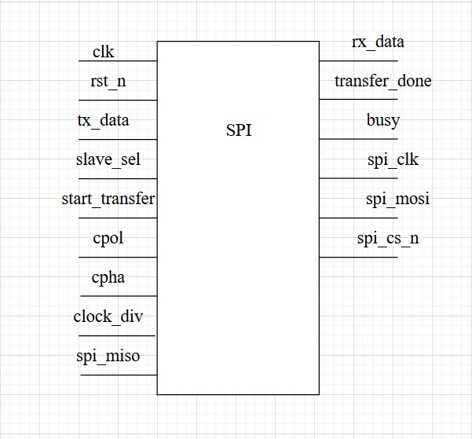
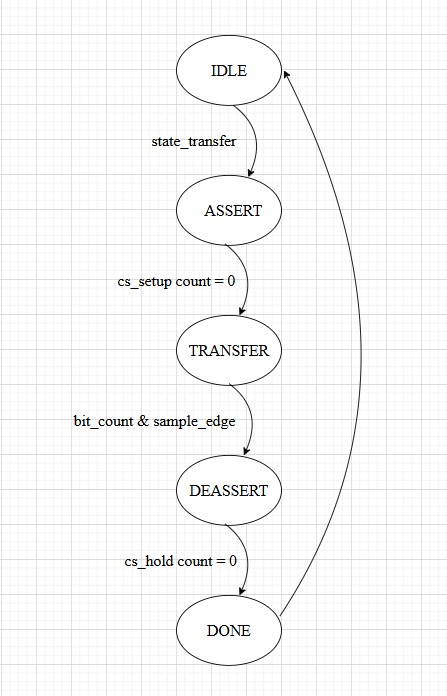
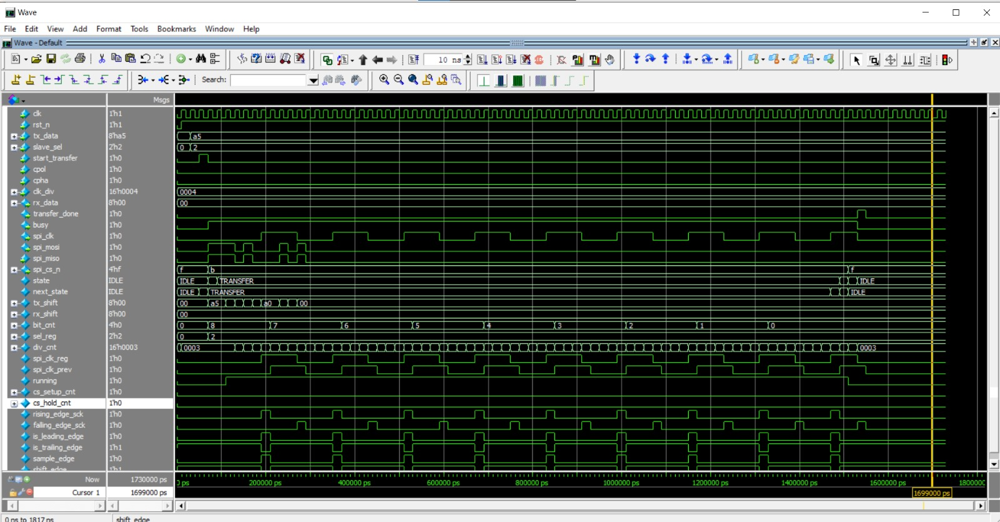
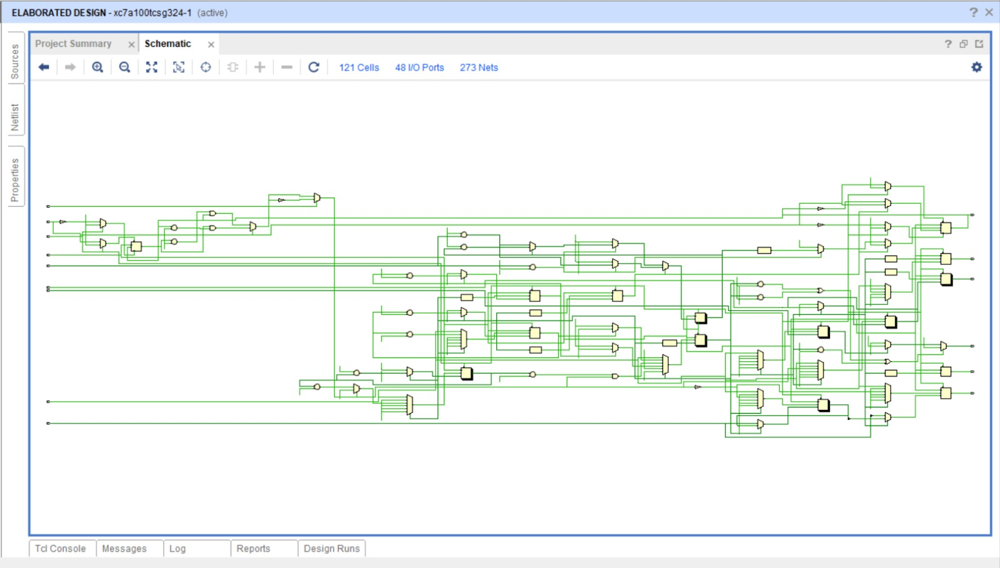

# SPI Master (Configurable Verilog Module)

##  Overview

This is a **parameterized SPI Master** implementation in SystemVerilog.
It supports:

* Multiple slaves (chip-select lines).
* Configurable data width.
* Programmable clock polarity (CPOL) and phase (CPHA).
* Programmable clock divider (for baud rate control).
* Chip-Select (CS) setup/hold timing.
* Standard SPI full-duplex communication (MOSI/MISO).

It is designed as a **simple FSM-based SPI controller** with a synchronous interface.

---
##  Fsm top module

---

##  Parameters

| Parameter         | Description                                                                                            |
| ----------------- | ------------------------------------------------------------------------------------------------------ |
| `NUM_SLAVES`      | Number of SPI slaves (default = 4).                                                                    |
| `DATA_WIDTH`      | Data word width in bits (default = 8).                                                                 |
| `CS_SETUP_CYCLES` | Delay (in system clock cycles) after CS assert before first clock edge. Ensures **tSS\_setup** timing. |
| `CS_HOLD_CYCLES`  | Delay (in system clock cycles) after last clock edge before CS deassert. Ensures **tSS\_hold** timing. |

---
## Finite state machine

---

##  Ports

### Inputs

| Signal           | Width               | Description                                                               |
| ---------------- | ------------------- | ------------------------------------------------------------------------- |
| `clk`            | 1                   | System clock.                                                             |
| `rst_n`          | 1                   | Active-low reset.                                                         |
| `tx_data`        | DATA\_WIDTH         | Data to be transmitted (MSB-first).                                       |
| `slave_sel`      | ⌈log2(NUM\_SLAVES)⌉ | Selects which slave CS line to assert.                                    |
| `start_transfer` | 1                   | 1-cycle pulse to begin transfer.                                          |
| `cpol`           | 1                   | SPI Clock Polarity: 0 = idle low, 1 = idle high.                          |
| `cpha`           | 1                   | SPI Clock Phase: 0 = sample on leading edge, 1 = sample on trailing edge. |
| `clk_div`        | 16                  | Clock divider (half-period in system clocks). Minimum = 1.                |

### Outputs

| Signal          | Width       | Description                                                     |
| --------------- | ----------- | --------------------------------------------------------------- |
| `rx_data`       | DATA\_WIDTH | Data received from slave (MISO).                                |
| `transfer_done` | 1           | Pulses high for 1 cycle when transfer finishes.                 |
| `busy`          | 1           | High while a transfer is in progress.                           |
| `spi_clk`       | 1           | SPI clock output (SCK).                                         |
| `spi_mosi`      | 1           | SPI Master-Out-Slave-In line.                                   |
| `spi_miso`      | 1           | SPI Master-In-Slave-Out line (input from slave).                |
| `spi_cs_n`      | NUM\_SLAVES | Active-low chip select lines. Only the selected slave goes low. |

---

##  Timing Notes

* **CPOL/CPHA Handling**

  * `cpol=0, cpha=0`: Sample on rising, shift on falling.
  * `cpol=0, cpha=1`: Shift on rising, sample on falling.
  * `cpol=1, cpha=0`: Sample on falling, shift on rising.
  * `cpol=1, cpha=1`: Shift on falling, sample on rising.

* **Chip Select (CS) Behavior**

  * Goes low on transfer start.
  * Stays low for `CS_SETUP_CYCLES` before first SCK edge.
  * Remains low for `CS_HOLD_CYCLES` after last bit is shifted.
  * Returns high after transfer completes.

* **Clock Divider**

  * `clk_div = 1` → toggles SCK every sys\_clk (fastest).
  * `clk_div = N` → half-period = N sys\_clk cycles.

---

##  State Machine

The FSM controls SPI transaction flow:

1. **IDLE** – Wait for `start_transfer`.
2. **ASSERT\_CS** – Assert CS and wait `CS_SETUP_CYCLES`.
3. **TRANSFER** – Shift out `tx_data` on MOSI, sample MISO into `rx_data`.
4. **DEASSERT\_CS** – Hold CS active for `CS_HOLD_CYCLES`.
5. **DONE\_STATE** – Raise `transfer_done` for 1 cycle, return to `IDLE`.

---
## Testbench verification module

---
## Vivado simulation

---
