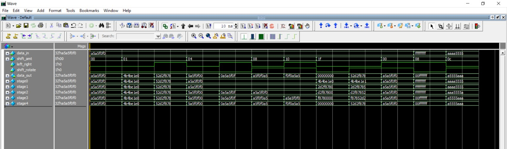
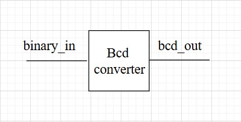
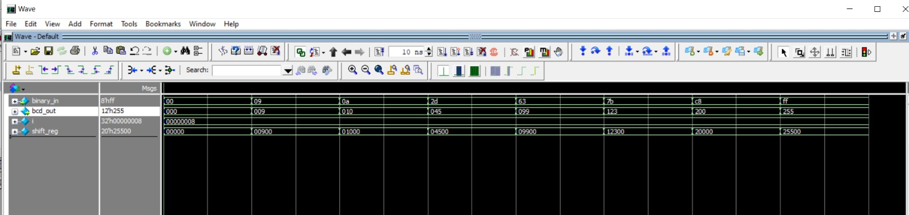

# 32-bit Barrel Shifter

This module implements a **32-bit Barrel Shifter** in SystemVerilog.  
A barrel shifter can shift or rotate data by a specified number of bit positions in a **single clock cycle** (combinational).  

---

##  Features
- Input: `data_in [31:0]` → 32-bit data to be shifted/rotated  
- Input: `shift_amt [4:0]` → Shift/rotate amount (0–31)  
- Input: `left_right` → Select direction  
  - `0` = Left  
  - `1` = Right  
- Input: `shift_rotate` → Select operation type  
  - `0` = Shift (fill with 0s)  
  - `1` = Rotate (wrap-around)  
- Output: `data_out [31:0]` → Result after shift/rotate  

---
## Top module :

 

---
##  Testbench Verification

 

---

# 8-bit Binary to BCD Converter

This module converts an **8-bit binary number (0–255)** into its **BCD (Binary-Coded Decimal)** representation.  
The output is a 12-bit BCD value consisting of **hundreds, tens, and ones** digits.  

It uses the **shift-and-add-3 algorithm (Double Dabble method)**, which is commonly used in hardware because it is simple and efficient.

---

##  Features
- Input: `binary_in [7:0]` → 8-bit binary (0–255)
- Output: `bcd_out [11:0]` → 3-digit BCD (`{hundreds, tens, ones}`)
- Algorithm: **Double Dabble (Shift-and-Add-3)**
- Purely **combinational** logic, no clock required

---
## Top Module:

 

---
##  Testbench Verification
 

---

