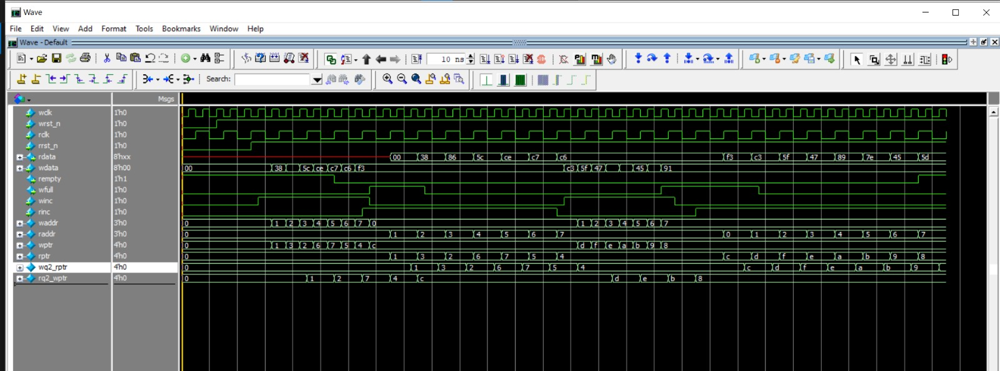

# Synchronous FIFO (sync\_fifo)

##  Overview

This module implements a **synchronous FIFO (First-In-First-Out) buffer**.
It supports **parameterizable data width and depth**, and provides status flags for **full, empty, almost full, and almost empty** conditions.

The FIFO allows **single-clock synchronous write and read operations**, making it suitable for buffering data between producer and consumer logic inside the same clock domain.

---
##  Synchronous fifo top module:
 

---
##  Features

* **Configurable parameters**

  * `DATA_WIDTH` → Width of stored data (default: 8 bits)
  * `FIFO_DEPTH` → Depth of FIFO (default: 16 entries)
  * `ALMOST_FULL_THRESH` → Threshold for almost full flag (default: 14)
  * `ALMOST_EMPTY_THRESH` → Threshold for almost empty flag (default: 2)

* **Status flags**

  * `full` → FIFO cannot accept more data
  * `empty` → No data available for read
  * `almost_full` → FIFO is near capacity
  * `almost_empty` → FIFO is nearly drained

* **Count tracking** → Maintains number of stored elements

* **Safe operation** → Prevents writes when full, prevents reads when empty

---

##  Inputs

| Signal    | Width             | Description          |
| --------- | ----------------- | -------------------- |
| `clk`     | 1-bit             | System clock         |
| `rst_n`   | 1-bit             | Active-low reset     |
| `wr_en`   | 1-bit             | Write enable         |
| `wr_data` | `DATA_WIDTH` bits | Data input for write |
| `rd_en`   | 1-bit             | Read enable          |

---

##  Outputs

| Signal         | Width                     | Description                          |
| -------------- | ------------------------- | ------------------------------------ |
| `rd_data`      | `DATA_WIDTH` bits         | Data output on read                  |
| `full`         | 1-bit                     | Asserted when FIFO is full           |
| `empty`        | 1-bit                     | Asserted when FIFO is empty          |
| `almost_full`  | 1-bit                     | Asserted when FIFO usage ≥ threshold |
| `almost_empty` | 1-bit                     | Asserted when FIFO usage ≤ threshold |
| `count`        | `log2(FIFO_DEPTH)+1` bits | Current number of stored entries     |

---

##  Internal Registers

* **`fifo[]`** → Memory array for storing data
* **`wr_ptr`** → Write pointer
* **`rd_ptr`** → Read pointer
* **`count`** → Current fill level

---

##  Operation

### 1. Write Operation

* If `wr_en = 1` and FIFO is **not full**:

  * Data from `wr_data` is stored at `fifo[wr_ptr]`
  * `wr_ptr` increments

### 2. Read Operation

* If `rd_en = 1` and FIFO is **not empty**:

  * Data at `fifo[rd_ptr]` is assigned to `rd_data`
  * `rd_ptr` increments

### 3. Count Logic

* If **write only** → `count` increases
* If **read only** → `count` decreases
* If **read & write together** → `count` unchanged

### 4. Status Flags

* **Full** → `count == FIFO_DEPTH - 1`
* **Empty** → `count == 0`
* **Almost Full** → `count == ALMOST_FULL_THRESH`
* **Almost Empty** → `count == ALMOST_EMPTY_THRESH`

---
## Testbench verification of module

#  Asynchronous FIFO Design

##  Overview

This project implements an **Asynchronous FIFO (First-In-First-Out) buffer**.
It is used for **clock domain crossing (CDC)**, where data written in one clock domain must be safely read in another.

The design ensures **data integrity** by using:

* **Gray-coded read/write pointers** → prevent glitches
* **Two-flop synchronizers** → reduce metastability
* **Empty & Full flag logic** → prevent underflow/overflow
* **Dual-port memory** → supports independent read and write

---

##  Asynchronous fifo top module: 

---

##  Modules

### 1 `FIFO_memory`

* **Function:** Stores the actual FIFO data
* **Key Features:**

  * Dual-port memory (separate read/write)
  * Depth = `2^ADDR_SIZE`
  * Prevents writes when full (`wfull`)
  * Prevents reads when empty (`rempty`)

**Ports:**

* `wdata` → Input data for write
* `rdata` → Output data for read
* `waddr`, `raddr` → Write and read addresses
* `wclk_en`, `wclk`, `wfull` → Write control
* `rempty` → Read control

---

### 2 `rptr_empty`

* **Function:** Handles **read pointer** logic & **empty flag** generation
* **Key Features:**

  * Maintains **binary read pointer (`rbin`)** and **Gray-coded pointer (`rptr`)**
  * Compares **read pointer** with synchronized write pointer (`rq2_wptr`)
  * Asserts `rempty = 1` when FIFO has no data

**Ports:**

* `raddr` → Read address for memory
* `rptr` → Gray-coded read pointer
* `rq2_wptr` → Synchronized write pointer (Gray code)
* `rempty` → Empty flag
* `rinc`, `rclk`, `rrst_n` → Read increment, clock, reset

---

### 3 `wptr_full`

* **Function:** Handles **write pointer** logic & **full flag** generation
* **Key Features:**

  * Maintains **binary write pointer (`wbin`)** and **Gray-coded pointer (`wptr`)**
  * Compares **write pointer** with synchronized read pointer (`wq2_rptr`)
  * Asserts `wfull = 1` when FIFO has no space left

**Ports:**

* `waddr` → Write address for memory
* `wptr` → Gray-coded write pointer
* `wq2_rptr` → Synchronized read pointer (Gray code)
* `wfull` → Full flag
* `winc`, `wclk`, `wrst_n` → Write increment, clock, reset

---

### 4 `two_ff_sync`

* **Function:** Synchronizes pointers across clock domains
* **Key Features:**

  * Implements **2-stage flip-flop synchronizer**
  * Prevents metastability when passing Gray-coded pointers between domains

**Ports:**

* `din` → Input data (pointer to be synchronized)
* `q2` → Stable synchronized output
* `clk`, `rst_n` → Synchronizer clock and reset

---

##  How It Works (System Flow)

1. **Write Side (wclk domain):**

   * `wptr_full` generates `wptr` and `waddr`
   * `FIFO_memory` writes data at `waddr` if `winc=1` and `!wfull`
   * `wptr` (Gray) is synchronized to read domain using `two_ff_sync`

2. **Read Side (rclk domain):**

   * `rptr_empty` generates `rptr` and `raddr`
   * `FIFO_memory` provides data from `raddr` if `!rempty`
   * `rptr` (Gray) is synchronized to write domain using `two_ff_sync`

3. **Empty & Full Detection:**

   * `rempty` asserted if next read pointer == synchronized write pointer
   * `wfull` asserted if next write pointer == synchronized read pointer (special Gray condition)

---

## Module verification

---

